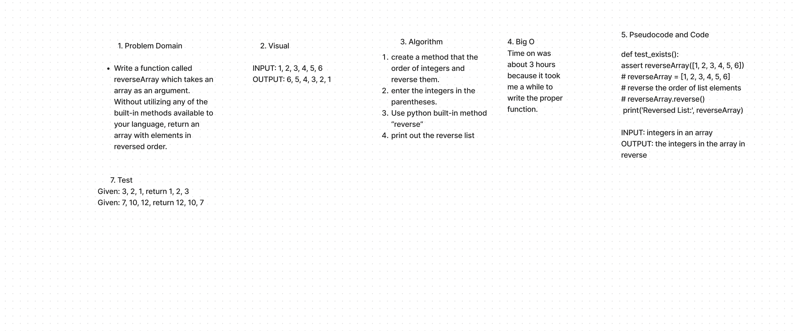

Code Challenge: Class 01 completed
Write a function called reverseArray which takes an array as an argument. Without utilizing any of the built-in methods available to your language, return an array with elements in reversed order.

## Whiteboard Process

## Approach & Efficiency
<!-- What approach did you take? Why? What is the Big O space/time for this approach? -->
I create a method that the order of integers and reverse them. enter the integers in the parentheses. Use python built-in method “reverse” print out the reverse list

## Solution
def test_exists():
assert reverseArray([1, 2, 3, 4, 5, 6])
# reverseArray = [1, 2, 3, 4, 5, 6]
# reverse the order of list elements
# reverseArray.reverse()
 print('Reversed List:', reverseArray)

INPUT: integers in an array
OUTPUT: the integers in the array in reverse

